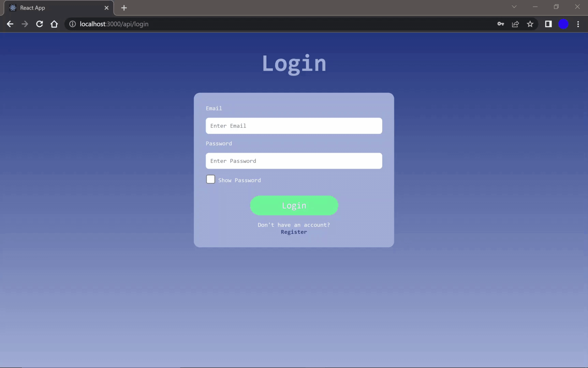

# Login System

The goal of this project is to develop a stateless login and registration system using JWT for user authentication. This project is built using MERN and follows standard RESTful practices for data transmission with JSON.

## Frontend
* Built using **React**, **Javascript**, **HTML**, and **CSS**.
* Utilizes **React Hooks** for simple state management.

## Backend
* Built using **Node** and **Express**.
* Utilizes stateless endponits with **JWT** validation middleware for user authentication.

## Database
* **MongoDB** used for data storage.
* Stores account information as **SHA256** digests.