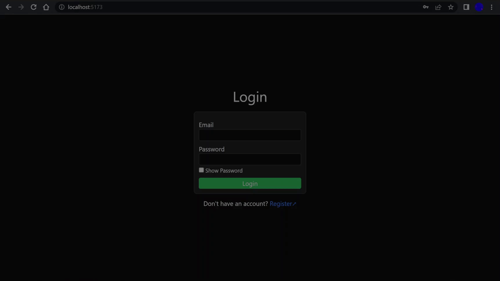

# Authentication System

The goal of this project is to develop a Full Stack (MERN) authentication system. User identity is verified through server-side JSON Web token validation.

## Frontend
* Built using **React**, **TypeScript**, **Tailwind**, and **Vite**.
* Utilizes **React Hooks** for simple state management.

## Backend
* Built using **Node** and **Express**.
* Utilizes stateless endponits with **JWT** validation middleware for user authentication.

## Database
* **MongoDB** used for data storage.
* Stores account information as **SHA256** digests.
